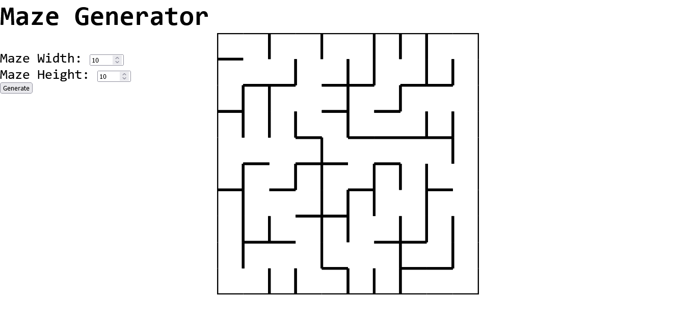
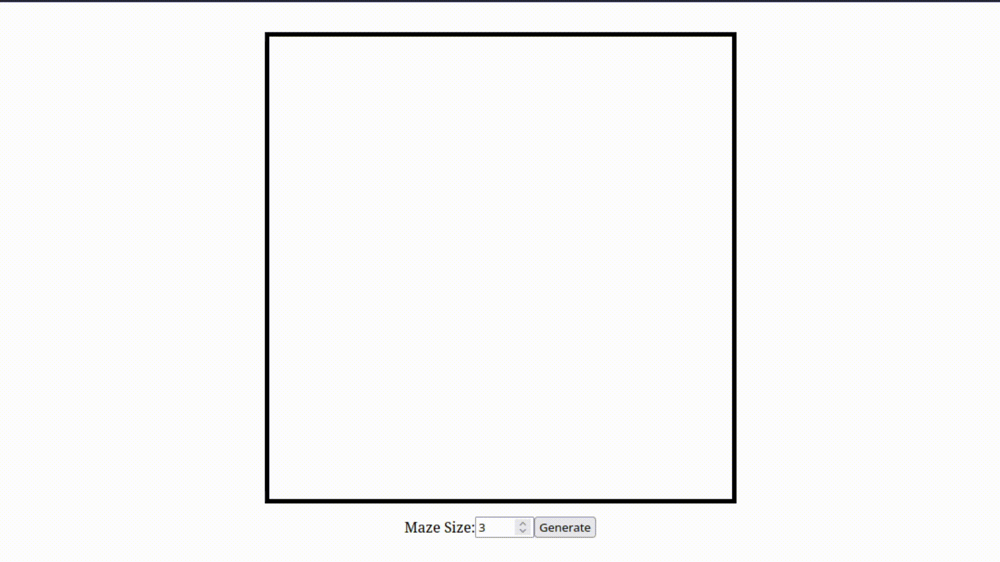

# Web Maze Generator
A JS implementation of the [Randomized Kruskal's algorithm](https://en.wikipedia.org/wiki/Maze_generation_algorithm#Randomized_Kruskal's_algorithm) for a maze generation web page

# Usage
The generator can be used by simply typing the maze size in the input field and clicking the generate button to generate a new random maze

**Attention!!!** The maximum maze size can vary according to your device specs. High maze sizes usually lag the web browser

# Todo:
- [ ] Functionality Improvements
  - [x] Turning the generator in its on separate module
  - [ ] Add a option to seed the generation
  - [ ] Make generation faster for higher maze sizes
  - [ ] Button to save a maze screenshot
